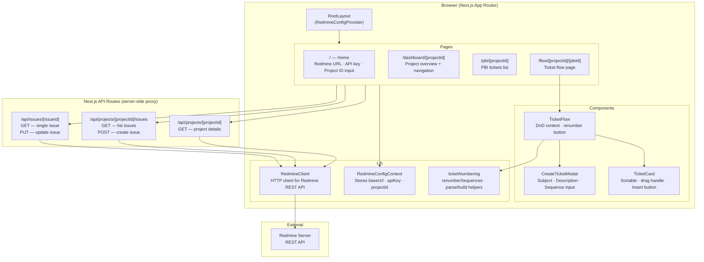
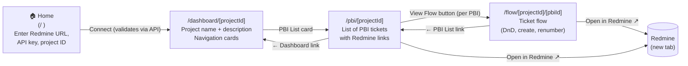

# Redmine Sprint Editor — Specification

A React/Next.js application for managing Redmine tickets specialised for agile sprints.

---

## Table of Contents

1. [Overview](#overview)
2. [Component Diagram](#component-diagram)
3. [Page Flow](#page-flow)
4. [Screen Descriptions](#screen-descriptions)
5. [Ticket Numbering System](#ticket-numbering-system)
6. [API Layer](#api-layer)
7. [Development Setup](#development-setup)
8. [CI / Release](#ci--release)

---

## Overview

Redmine Sprint Editor lets teams manage Redmine tickets for agile sprints without leaving a purpose-built UI. It:

- Accepts a Redmine server URL, an API key, and a project ID.
- Shows a **dashboard** for the selected project.
- Shows a **PBI (Product Backlog Item) list** with direct Redmine links.
- Shows a **ticket flow** for each PBI — an ordered/parallel visual flow of child tickets that supports drag-and-drop reordering and inline ticket creation.
- Provides a **renumber** action that reassigns sequence numbers consistently after reordering.

---

## Component Diagram



---

## Page Flow



---

## Screen Descriptions

### Home (`/`)

**Purpose:** Initial entry point. Accepts connection details.

| Field | Description |
|-------|-------------|
| Redmine URL | Full base URL of the Redmine instance, e.g. `https://redmine.example.com` |
| API Key | User's Redmine API key (stored in `sessionStorage`, not persisted across sessions) |
| Project ID | Redmine project identifier or numeric ID, e.g. `my-project` |

Clicking **Connect** validates the credentials by fetching the project from the API. On success the user is redirected to the Dashboard.

---

### Dashboard (`/dashboard/[projectId]`)

**Purpose:** Project overview and navigation hub.

Displays:
- Project name and description.
- Navigation card for **PBI List**.

---

### PBI List (`/pbi/[projectId]`)

**Purpose:** Shows all Product Backlog Item tickets for the project.

Each row shows:
- Ticket ID and status badge.
- Subject (title) and description excerpt.
- **Open in Redmine ↗** link (new tab).
- **View Flow** button → navigates to the flow page for that PBI.

> **Convention:** PBI tickets are identified by `tracker_id=2` (Feature tracker). Configure as needed for your Redmine instance.

---

### Ticket Flow (`/flow/[projectId]/[pbiId]`)

**Purpose:** Visual ordered/parallel flow of child tickets under a PBI.

Features:
- **Drag and drop** to reorder tickets (updates Redmine subject with embedded sequence tag).
- **+ Insert** button on each ticket to open the Create Ticket modal positioned after that ticket.
- **+ Add ticket at end** shortcut.
- **🔢 Renumber** button — reassigns all sequence numbers so they are contiguous and correctly ordered (see [Ticket Numbering System](#ticket-numbering-system)).

**Sequence tag convention:**  
Ticket subjects embed the sequence as a prefix: `[<sequence>] <title>`  
Example: `[2-a] Implement login UI`

---

## Ticket Numbering System

Tickets within a PBI flow are numbered with the pattern **`n-n-n-n`** where each segment `n` is either:

| Segment type | Character | Meaning |
|---|---|---|
| **Ordered** | Digit(s) e.g. `1`, `12` | Must be performed in this order |
| **Parallel** | Letter(s) e.g. `a`, `b` | May be performed in any order (concurrent with siblings) |

### Examples

```
1           – first ordered step
2           – second ordered step
2-a         – first parallel variant under step 2
2-b         – second parallel variant under step 2
3-1         – first sub-step of step 3
3-1-a       – first parallel sub-step under 3-1
```

### Renumbering rules

The **Renumber** button calls `renumberSequences()` which:

1. Walks tickets in their current display order.
2. Resets the top-level ordered counter to start at `1`.
3. Within each group sharing the same top-level ordered segment, resets parallel letters to start at `a`.
4. Deep sub-segments are preserved as-is (sub-segment renumbering follows the same rules recursively).

### Numbering is independent per PBI

Each PBI has its own numbering namespace starting from `1`.

---

## API Layer

All Redmine calls are proxied through Next.js API routes so that the API key never leaves the server and CORS restrictions are avoided.

Every API route accepts `?baseUrl=...&apiKey=...` query parameters (passed from the client, which reads them from `sessionStorage`).

| Route | Method | Description |
|---|---|---|
| `/api/projects/[projectId]` | `GET` | Fetch project details |
| `/api/projects/[projectId]/issues` | `GET` | List issues (supports `tracker_id`, `parent_id` filters) |
| `/api/projects/[projectId]/issues` | `POST` | Create a new issue |
| `/api/issues/[issueId]` | `GET` | Fetch single issue |
| `/api/issues/[issueId]` | `PUT` | Update an issue (e.g. rename subject after renumber) |

---

## Development Setup

```bash
# Install dependencies
npm install

# Start development server
npm run dev

# Run tests
npm test

# Build for production
npm run build
```

---

## CI / Release

| Workflow | Trigger | Description |
|---|---|---|
| `ci.yml` | Push/PR to `main` or `copilot/**` | Lint → test → build |
| `release.yml` | Push to `main` | Run tests then `semantic-release` |

Releases follow [Conventional Commits](https://www.conventionalcommits.org/):

| Commit type | Release bump |
|---|---|
| `fix:` | patch |
| `feat:` | minor |
| `BREAKING CHANGE` | major |

Changelog is auto-generated in `CHANGELOG.md` and a GitHub Release is created automatically.
